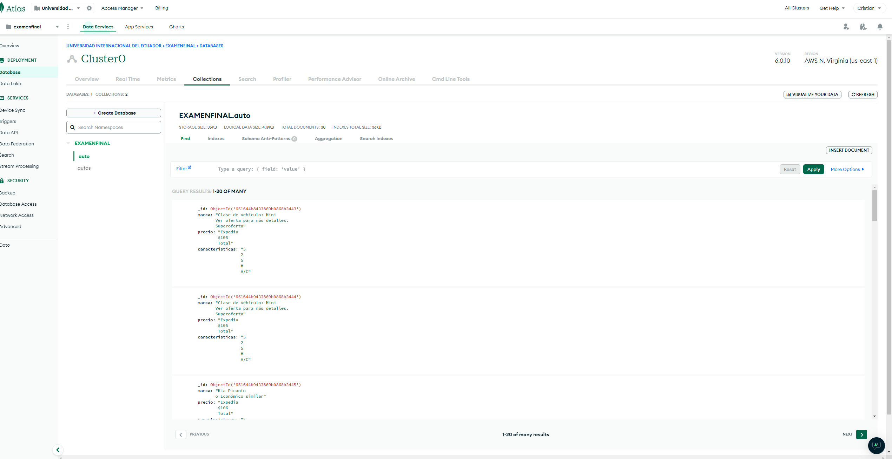

# Examenfinal1
 Parte 1
Consigue extraer datos de una fuente de datos online.

Para la parte 1 decidí, extraer los datos de la página KAYAK, para la renta de autos.

 Parte 2
Almacenar esta información de forma estructurada en una base de datos en la nube, puede
ser tipo MongoDB (Mongo Atlas) o una base de datos tipo SQL.
para la parte 2 utilice MongoDB, para almacenar los datos extraidos.
.

